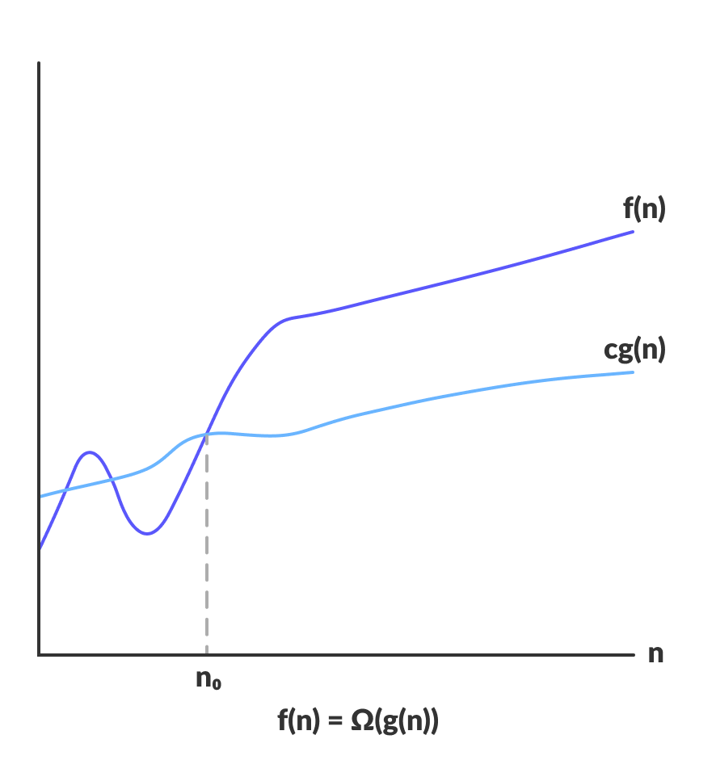

<div dir="rtl">
	  
# Time Complexity - پیچیدگی زمانی

هنگامی که برنامه‌ای می‌نویسیم و یا الگوریتمی طراحی می‌کنیم، از مهم‌ترین مسائلی که باید به آن توجه کنیم زمان اجرا است. (به طور مشابه تمام توضیحات زیر برای حافظه‌ی مصرفی نیز صادق است)
زمان اجرای یک برنامه به عوامل متعددی وابسته است که چند مورد آن در زیر آورده شده است:
* سخت افزار
* کامپایلر (زبان برنامه نویسی)
* اندازه‌ی ورودی
* ماهیت ورودی
* و ...

قصد ما این است که الگوریتم‌ها را از نظر زمانی تحلیل و مقایسه کنیم. پس یک نکته‌ي خیلی مهم اینجا وجود دارد؛ اگر دقت کنیم می‌بینیم تمام موارد بالا بجز اندازه‌ی ورودی، در یک برنامه‌ي بخصوص مقادیر ثابتی هستند و با اجرا‌های مختلف تغییر نمی‌کنند. پس تنها «اندازه‌ي ورودی» است که می‌تواند در اجرا‌های مختلف برنامه، تاثیر غیرثابتی بر روی زمان اجرا داشته باشد. پس زمان اجرای الگوریتم‌ها تابعی از اندازه‌ی ورودیشان هستند و هدف ما آن است که رابطه‌ی این تابع را بدست آوریم.

برای تحلیل الگوریتم‌ها سه
notation
مهم وجود دارد:

##### نوتیشن Big Oh(  ):
حد بالای زمان اجرای یک الگوریتم را مشخص می‌کند. در واقع مشخص کننده پیچیدگی زمانی بدترین حالت
(worst case)
اجرای یک الگوریتم است. (تخمین بالا)

تعریف ریاضی آن به شکل زیر است:

<!-- ```math
O(g(n)) = { f(n): \text{there exist positive constants c and } n_0
            \text{ such that } 0 ≤ f(n) ≤ cg(n) \text{ for all } n ≥ n_0 }
``` -->
<div align="center">
	<b align="center">
		O(g(n)) = { f(n): there exist positive constants c and n<sub>0</sub>
            such that 0 ≤ f(n) ≤ cg(n) for all n ≥ <sub>0</sub> }
	</b>
</div>
<p align="center">
	
</p>

##### نوتیشن Big Omega(  ):
حد پایین زمان اجرای یک الگوریتم را مشخص می‌کند. در واقع مشخص کننده پیچیدگی زمانی بهترین حالت 
(best case)
اجرای یک الگوریتم است. (تخمین پایین)

تعریف ریاضی آن به شکل زیر است:
<!-- ```math
\Omega(g(n)) = { f(n): \text{ there exist positive constants c and } n_0 
            \text{ such that } 0 ≤ cg(n) ≤ f(n) \text{ for all } n ≥ n_0 }
``` -->
<div align="center">
	<b align="center">
		Ω(g(n)) = { f(n): there exist positive constants c and <sub>0</sub> 
            such that 0 ≤ cg(n) ≤ f(n) for all n ≥ <sub>0</sub> }
	</b>
</div>
<p align="center">
	
</p>

##### نوتیشن Big Theta(  ):
حدود متوسط زمان اجرای یک الگوریتم را مشخص می‌کند. در واقع مشخص کننده پیچیدگی زمانی حالت متوسط
(average case)
اجرای یک الگوریتم است. (تخمین دقیق)

تعریف ریاضی آن به شکل زیر است:
<!-- ```math
\Theta(g(n)) = { f(n): \text{there exist positive constants c1, c2 and }n_0
            \text{ such that } 0 ≤ c1g(n) ≤ f(n) ≤ c2g(n) \text{ for all } n ≥ n_0 }
``` -->
<div align="center">
	<b align="center">
		Θ(g(n)) = { f(n): there exist positive constants c1, c2 and <sub>0</sub>
            such that 0 ≤ c1g(n) ≤ f(n) ≤ c2g(n) for all n ≥ <sub>0</sub> }
	</b>
</div>
<p align="center">
	
</p>

از میان این ۳، معمولا
Big Oh (O)
از اهمیت بیشتری برخوردار است و کاربرد بیشتری دارد. چرا؟
چون برای ما 
worst case
مهم است. به طور مثال ما نمی‌خواهیم برنامه‌مان در ۹۵ درصد مواقع درست کار کند اما در ۵ درصد مواقع بیش از اندازه طول بکشد یا اصلا کار نکند. به همین خاطر باید همیشه
worst case
ها را در نظر داشت.

لفظ 
Order
نیز از همینجاست. وقتی می‌گوییم یک الگوریتم از اوردر 

است، به این معنی است که نرخ رشد زمان اجرای این الگوریتم با زمان از توان ۲ است.

#### چند قاعده برای تحلیل زمان اجرا
* تمام دستورات ساده مثل
read
و
write
و...
O(1) = Θ(1) = Ω(1)
هستند.
* عملگرها 
(+, -, *, /, =, ...)
 O(1) = Θ(1) = Ω(1)
هستند.
* تعداد ثابتی از دستورات ساده 
 O(1) = Θ(1) = Ω(1)
هستند. مثل:
<span dir="ltr">

```pseudocode
temp = b
b = a
a = temp
// All together: Θ(1)
```
</span>

* در چند قطعه متوالی از برنامه، هزینه برابر با هزینه‌ قطعه ماکسیمم است.
* هزینه حلقه برابر است با (هزینه بدنه)*(تعداد تکرار)
* هزینه 
if
و
else
ها برابر با ماکسیمم هزینه‌ی بدنه‌ها است. مثال:
<span dir="ltr">

```pseudocode
if condition:
	body1 // T1
else:
	body2 // T2
// All together: O(max(T1, T2))
```
</span>

<hr>

### - نمونه سوال 1
ثابت کنید تابع 

متعلق به 

است (توابع چندجمله‌ای، از مرتبه‌ی پرتوان‌ترین جمله هستند). تمام ضرایب 

اعدادی ثابت هستند.


<details>
<summary>نمایش پاسخ</summary>
<br>

<br>

<br>
0:f(n)\leq{cn^k},\quad{c}=\sum_{i=0}^ka_i" />
<br>

</details>

<br>
<hr>

### - نمونه سوال 2
مرتبه‌ی زمانی قطعه‌کد زیر را محاسبه کنید:

<div dir="ltr">

```pseudocode
int f(n) {
	int s = 0;
	for(int i=n; i>0; i--);
		for(int j=1; j<n; j*=2);
			for(int k=0; k<j; k++);
				s+=i*j+k;
	return s;
}
```
</div>

<details>
<summary>نمایش پاسخ</summary>
<br>
<p align="right" dir="rtl">
حلقه‌ی 

به اندازه‌ی 

بار اجرا می‌شود. برای بررسی تعداد دفعات اجرای حلقه‌ی 

می‌توان نوشت (تصاعد هندسی):
</p>

<p align="right" dir="rtl">
بنابراین، دو حلقه‌ی 

و 

با هم از 

می‌باشند. با توجه به این که حلقه‌ی اول 

بار اجرا می‌شود:
</p>

</details>
<hr>
