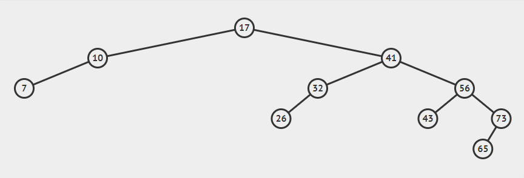

<div dir="rtl">

# قالب نمونه سند
## header test
این قالب جهت الگو برداری برای ساخت دیگر اسناد آماده شده است.

موارد قابل توجه در هر سند:
- توجه داشته باشید هر سند باید داری قسمت توضیحات باشد
- در هر سند تا حد امکان از گیف برای اینکه مفهوم را بهتر برسانید استفاده کنید
- برای هر فصل یه فولدر ایجاد کرده و محتویات مورد نیار را درون آن قرار دهید



##### مثال یک گیف


```
if (isTrue)
  return "yes"
```
</div>
