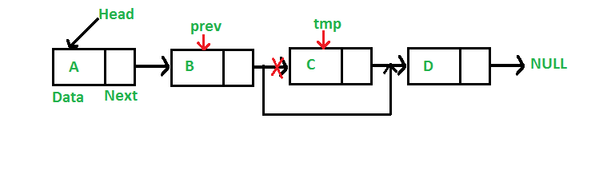

<div dir="rtl">

# بخش اول : لیست پیوندی و آرایه
### لیست پیوندی - (Linked List)

لیست پیوندی شامل مجموعه ای از المان هاست که آن ها را با `node` میشناسیم و 
هرکدام از این `node` ها<br>
با کمک یک اشاره گر 
 به نام `next` به `node` بعدی متصل شده است.(مانند شکل زیر) <br><br>
 <br>
هر`node` علاوه بر اشاره گر `next` که برای وصل شدن به `node` بعدی استفاده میشود دارای ویژگی به نام `data` است که
<br>اطلاعات آن `node` را در خود نگه میدارد.
جنس این اطلاعات با توجه به تعریف `node` میتواند هرچیزی (string , int , ... ) باشد. <br><br>
در لیست پیوندی`head` اشاره گری است که به اولین `node` لیست پیوندی اشاره میکند و برای پیمایش و دسترسی به بقیه ی `node` ها <br>
باید از `head` شروع کرده و با کمک اشاره گر های `next` به جلو رفته تا به `node` مورد نظر خود برسیم. <br>
به عبارت دیگر بر خلاف آرایه دیگر با کمک اندیس نمیتوانیم به اطالاعات هر خانه دسترسی پیدا کنیم.<br>
در لیست پیوندی اشاره گر `next` آخرین `node` به `null` اشاره میکند که نشان دهنده ی پایان لیست پیوندی است. <br><br>
برای اضافه کردن یا حذف کردن یک `node` از لیست پیوندی باید به این موارد توجه داشت :<br>  

1- اشاره گر `head` همیشه به اولین `node` اشاره کند.<br>
2- اشاره گر `next` آخرین `node` به `null` اشاره کند.<br>
3- از اول تا آخر لیست زنجیره متصل بماند.<br>

<details>
  <summary> اضافه کردن node به ابتدای لیست پیوندی  </summary>
<p>
برای اینکار نیاز است مانند شکل زیر اشاره‌گر `head` را به `node` جدید تغییر دهیم. همچنین اشاره‌گر `next` برای `head` جدید را به `head` قبلی متصل کنیم.
</p>
   <br>
</details>

<details>
  <summary> اضافه کردن node به اواسط لیست پیوندی  </summary>
  <br>
</details>

<details>
  <summary> اضافه کردن node به آخر لیست پیوندی  </summary>
  
</details>

<details>
  <summary> حذف کردن node از لیست پیوندی  </summary>
  
</details>
<br><br><br>

 
 ### چند نمونه مساله برای لیست پیوندی <br><br>
<details>
  <summary> با دریافت کردن یک newNode که data آن عدد است این newNode را در جای مناسب خود در لیست پیوندی sort شده صعودی قرار دهید.  </summary>
 <div dir="ltr">
  
 ```pseudocode
 
 node tmp
 tmp = head
 while tmp.next.data < newNode.data :
      tmp = tmp.next
 newNode.next = tmp.next
 tmp.next = newNode.next
 
 ```
 </div>
 برای مشاهده کد کامل می توانید لینک زیر را مشاهده کنید :
 
 [Related Link](http://www.geeksforgeeks.org/given-a-linked-list-which-is-sorted-how-will-you-insert-in-sorted-way/#:~:text=Algorithm%3A,start%20and%20make%20it%20head)
 
</details>

<details>
  <summary> با پیمایش بر روی یک لیست پیوندی sort شده node هایی که دو بار تکرار شدند را حذف کنید.  </summary>
 <div dir="ltr">
  
 ```pseudocode
 
itr = head
While itr->next is not 0:
if itr->data == itr->next->data:
dup = itr->next
itr->next = itr->next->next
delete dup
else
itr = itr->next
 
 ```
 </div>
 برای مشاهده کد کامل می توانید لینک زیر را مشاهده کنید :
 
 [Related Link](https://www.geeksforgeeks.org/remove-duplicates-from-a-sorted-linked-list/)
 
</details>

<details>
  <summary> بدون در نظر گرفتن حافظه اضافی و دریافت نشانه گر head یک لیست پیوندی آن لیست را برعکس کنید.  </summary>
 <div dir="ltr">
  
 ```pseudocode
 
 previous = null
current = head
next = null
while(current != null)
{
	next = current.next
	current.next = previous
	previous = current
	current = next
}
head = previous

 ```
 </div>
 برای مشاهده کد کامل می توانید لینک زیر را مشاهده کنید :
 
 [Related Link](https://www.geeksforgeeks.org/reverse-a-linked-list/)
 
</details>


</div>
